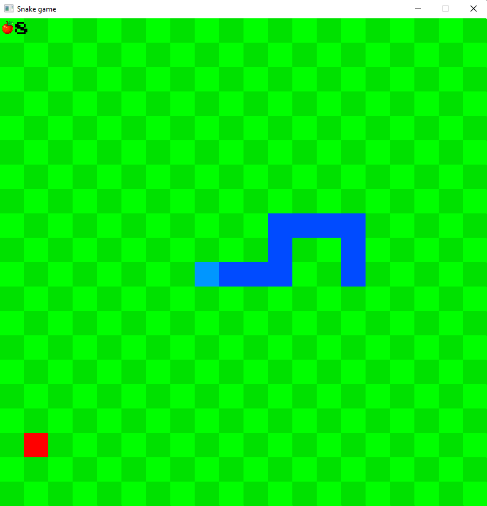
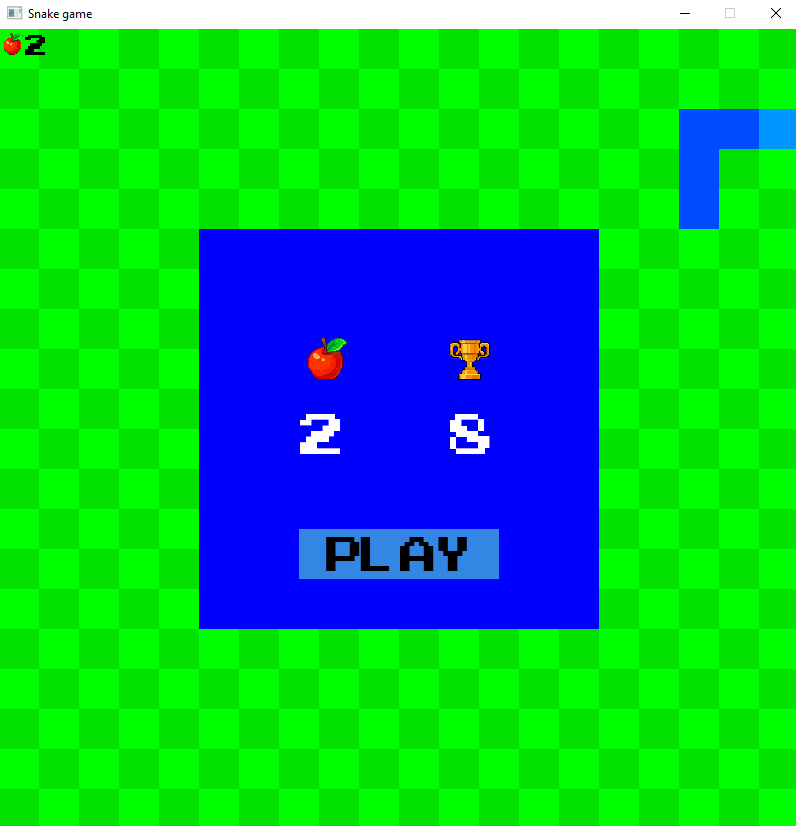

# Overall
## Description
This is my third project created using C++ with the assist of the SFML library.
It is a simple snake game, with **very** basic graphics. As it was a quick weekend project I focused much more on implementing functionality and keeping the code in a clear manner than beautyfing the details.

There are multiple comments explaining the code and the flow of the program which might make it a good reference source.
## How to play yourself?
In order to launch the game :
1. Download / copy the repository to your Windows device
2. Open the ForDistribution directory
3. Launch .exe file
## Environment
As mentioned above the project was created using C++ (20) with help of the SFML (*Simple and Fast Media*) library. The IDE I used was Microsoft Visual Studio Community Edition.
## Assets
The only assets included are the font, two icons (trophy and apple) and one button image.
All apart from the button image which I created myself in Adobe Photoshop were downloaded from the web.
## Features
- Game Score is presented in the left upper corner of the game and updated accordingly.
- After the game is over, the user is presented with a game score and highscore screen.
- The user can start a new game with a press of the button.
- Moving can be done using WASD or ARROW KEYS
- Pressing any moving button that doesn't point in the snake's body direction **will start the game**
- Game difficulty increases as player gets more points (from 0.25 seconds per frame to 0.10 seconds per frame)

